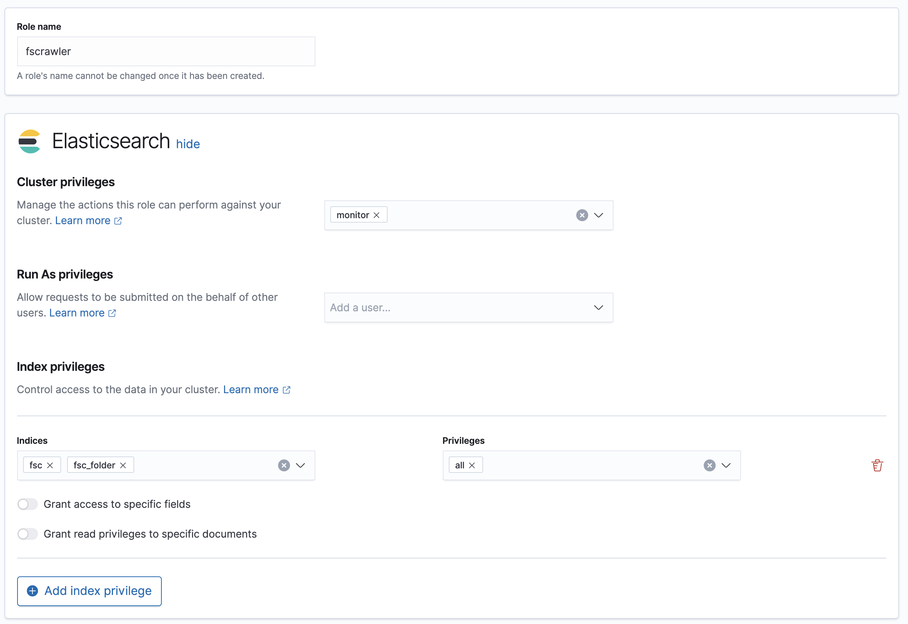

(elasticsearch-settings)=
# Elasticsearch settings

```{contents}
:backlinks: entry
```

Here is a list of Elasticsearch settings (under `elasticsearch.` prefix):

| Name                                 | Environment Variable                           | Default value            | Documentation                                                 |
|--------------------------------------|------------------------------------------------|--------------------------|---------------------------------------------------------------|
| `elasticsearch.index`                | `FSCRAWLER_ELASTICSEARCH_INDEX`                | job name + `_docs`       | [Index settings for documents](#index-settings-for-documents) |
| `elasticsearch.index_folder`         | `FSCRAWLER_ELASTICSEARCH_INDEX_FOLDER`         | job name + `_folder`     | [Index settings for folders](#index-settings-for-folders)     |
| `elasticsearch.push_templates`       | `FSCRAWLER_ELASTICSEARCH_PUSH_TEMPLATES`       | `true`                   | {ref}`mappings`                                               |
| `elasticsearch.force_push_templates` | `FSCRAWLER_ELASTICSEARCH_FORCE_PUSH_TEMPLATES` | `false`                  | {ref}`mappings`                                               |
| `elasticsearch.bulk_size`            | `FSCRAWLER_ELASTICSEARCH_BULK_SIZE`            | `100`                    | [Bulk settings](#bulk-settings)                               |
| `elasticsearch.flush_interval`       | `FSCRAWLER_ELASTICSEARCH_FLUSH_INTERVAL`       | `"5s"`                   | [Bulk settings](#bulk-settings)                               |
| `elasticsearch.byte_size`            | `FSCRAWLER_ELASTICSEARCH_BYTE_SIZE`            | `"10mb"`                 | [Bulk settings](#bulk-settings)                               |
| `elasticsearch.pipeline`             | `FSCRAWLER_ELASTICSEARCH_PIPELINE`             | `null`                   | {ref}`ingest_node`                                            |
| `elasticsearch.semantic_search`      | `FSCRAWLER_ELASTICSEARCH_SEMANTIC_SEARCH`      | `true`                   | {ref}`semantic_search`                                        |
| `elasticsearch.urls`                 | `FSCRAWLER_ELASTICSEARCH_URLS`                 | `https://127.0.0.1:9200` | [Node settings](#node-settings)                               |
| `elasticsearch.path_prefix`          | `FSCRAWLER_ELASTICSEARCH_PATH_PREFIX`          | `null`                   | [Path prefix](#path-prefix)                                   |
| `elasticsearch.api_key`              | `FSCRAWLER_ELASTICSEARCH_API_KEY`              | `null`                   | [API Key](#api-key)                                           |
| `elasticsearch.username`             | `FSCRAWLER_ELASTICSEARCH_USERNAME`             | `null`                   | {ref}`credentials`                                            |
| `elasticsearch.password`             | `FSCRAWLER_ELASTICSEARCH_PASSWORD`             | `null`                   | {ref}`credentials`                                            |
| `elasticsearch.ssl_verification`     | `FSCRAWLER_ELASTICSEARCH_SSL_VERIFICATION`     | `true`                   | {ref}`ssl`                                                    |
| `elasticsearch.ca_certificate`       | `FSCRAWLER_ELASTICSEARCH_CA_CERTIFICATE`       | `null`                   | {ref}`ssl`                                                    |


## Index settings

### Index settings for documents

By default, FSCrawler will index your data in an index which name is
the same as the crawler name (`name` property) plus `_docs` suffix, like
`test_docs`. You can change it by setting `index` field:

```yaml
name: "test"
elasticsearch:
  index: "docs"
```

### Index settings for folders

FSCrawler will also index folders in an index which name is the same as
the crawler name (`name` property) plus `_folder` suffix, like
`test_folder`. You can change it by setting `index_folder` field:

```yaml
```

  name: "test"
  elasticsearch:
    index_folder: "folders"

(mappings)=
### Mappings

```{versionadded} 2.10
```

FSCrawler defines the following [Component Templates](https://www.elastic.co/guide/en/elasticsearch/reference/current/index-templates.html)
to define the index settings and mappings (replace `INDEX` with the index name):

- `fscrawler_INDEX_alias`: defines the alias which name is the same as the crawler name (`name` property) so you can search using this alias.
- `fscrawler_INDEX_settings_total_fields`: defines the maximum number of fields for the index.
- `fscrawler_INDEX_mapping_attributes`: defines the mapping for the `attributes` field.
- `fscrawler_INDEX_mapping_file`: defines the mapping for the `file` field.
- `fscrawler_INDEX_mapping_path`: defines an define an analyzer named `fscrawler_path` which uses a
  [path hierarchy tokenizer](https://www.elastic.co/guide/en/elasticsearch/reference/current/analysis-pathhierarchy-tokenizer.html)
  and the mapping for the `path` field.

- `fscrawler_INDEX_mapping_attachment`: defines the mapping for the `attachment` field.
- `fscrawler_INDEX_mapping_content_semantic`: defines the mapping for the `content` field when using semantic search.
It also creates a `semantic_text` field named `content_semantic`. Please read the {ref}`semantic_search` section.

- `fscrawler_INDEX_mapping_content`: defines the mapping for the `content` field when semantic search is not available.
- `fscrawler_INDEX_mapping_meta`: defines the mapping for the `meta` field.

You can see the content of those templates by running:

```none
GET _component_template/fscrawler*
```

Then, FSCrawler applies those templates to the indices being created.

By default, FSCrawler will check if the index template already exists before creating templates.
If the index template exists, FSCrawler will skip the templates management, preserving any
custom component templates you may have defined in advance.

This means you can create your own component template before starting FSCrawler. FSCrawler will then create all the
missing component templates if any (but not the ones you already defined) and create the index template.

You can stop FSCrawler creating/updating the index templates for you
by setting `push_templates` to `false`:

```yaml
name: "test"
elasticsearch:
  push_templates: false
```

If you want to force FSCrawler to push all templates (overwriting any existing ones),
you can set `force_push_templates` to `true`:

```yaml
name: "test"
elasticsearch:
  force_push_templates: true
```

If you want to know what are the component templates and index templates
that will be created, you can get them from [the source](https://github.com/dadoonet/fscrawler/blob/master/elasticsearch-client/src/main/resources/fr/pilato/elasticsearch/crawler/fs/client/9).

#### Creating your own mapping (analyzers)

If you want to define your own index settings and mapping to set
analyzers for example, you can create the needed component template
**before starting FSCrawler**.

FSCrawler will detect that the component template already exists and will not override it.
It will only create the missing component templates and the index template.

For example, you can define in advance your own component template `fscrawler_fscrawler_mapping_content`:

```none
PUT _component_template/fscrawler_fscrawler_mapping_content
{
 "template": {
   "mappings": {
     "properties": {
       "content": {
         "type": "text",
         "analyzer": "french"
       }
     }
   }
 }
}
```

Then start FSCrawler. It will create all the component templates but `fscrawler_fscrawler_mapping_content`
(which you already defined) and create the index template.

```{note}

 If someone wants to force pushing all the templates again (for example after an upgrade),
 they can use `force_push_templates: true`. In the above example, the custom
 `fscrawler_fscrawler_mapping_content` component template would be overridden.
```

The following example uses a `french` analyzer to index the
`content` field and still allow using semantic search.

```none
PUT _component_template/fscrawler_fscrawler_mapping_content_semantic
{
 "template": {
   "mappings": {
     "properties": {
       "content": {
         "type": "text",
         "analyzer": "french",
         "copy_to": "content_semantic"
       },
       "content_semantic": {
         "type": "semantic_text"
       }
     }
   }
 }
}
```

The following example uses a `french` analyzer to index the
`content` field.

```none
PUT _component_template/fscrawler_fscrawler_mapping_content
{
 "template": {
   "mappings": {
     "properties": {
       "content": {
         "type": "text",
         "analyzer": "french"
       }
     }
   }
 }
}
```

```{tip}

 You can launch FSCrawler with `--loop 0` to see what component templates and index templates
 would be created without indexing any document. Then you can create your own custom component
 templates and restart FSCrawler. Your custom templates will be preserved.
```

#### Replace existing mapping

Unfortunately you can not change the mapping on existing data.
Therefore, you’ll need first to remove existing index, which means
remove all existing data, and then restart FSCrawler with the new
mapping.

You might to try `elasticsearch Reindex
API <https://www.elastic.co/guide/en/elasticsearch/reference/current/docs-reindex.html>`__
though.

(semantic_search)=
#### Semantic search

```{versionadded} 2.10
```

FSCrawler can use [semantic search](https://www.elastic.co/guide/en/elasticsearch/reference/current/semantic-search.html)
to improve the search results.

```{note}

 Semantic search is available starting from Elasticsearch 8.17.0 and requires a trial or enterprise license.
```

Semantic search is enabled by default when an Elasticsearch 8.17.0 or above and a trial or enterprise license are
detected. But you can disable it by setting `semantic_search` to `false`:

```yaml
name: "test"
elasticsearch:
  semantic_search: false
```

When activated, the `content` field is indexed as usual but a new field named `content_semantic`
is created and uses the [semantic_text](https://www.elastic.co/guide/en/elasticsearch/reference/current/semantic-text.html)
field type. This field type is used to store the semantic information extracted from the content by using the defined
inference API (defaults to [Elser model](https://www.elastic.co/guide/en/machine-learning/current/ml-nlp-elser.html)).

You can change the model to use by changing the component template. For example, a recommended model when you have only
english content is the Elastic [multilingual-e5-small](https://www.elastic.co/guide/en/machine-learning/current/ml-nlp-multilingual-e5-small.html):

```none
 PUT _component_template/fscrawler_fscrawler_mapping_content_semantic
 {
   "template": {
     "mappings": {
       "properties": {
         "content": {
           "type": "text",
           "copy_to": "content_semantic"
         },
         "content_semantic": {
           "type": "semantic_text",
           "inference_id": ".multilingual-e5-small-elasticsearch"
         }
       }
     }
   }
 }
```

## Bulk settings

FSCrawler is using bulks to send data to elasticsearch. By default the
bulk is executed every 100 operations or every 5 seconds or every 10 megabytes. You can change
default settings using `bulk_size`, `byte_size` and `flush_interval`:

```yaml
```

  name: "test"
  elasticsearch:
    bulk_size: 1000
    byte_size: "500kb"
    flush_interval: "2s"

```{tip}

 Elasticsearch has a default limit of `100mb` per HTTP request as per
 [elasticsearch HTTP Module](https://www.elastic.co/guide/en/elasticsearch/reference/current/modules-http.html)
 documentation.

 Which means that if you are indexing a massive bulk of documents, you
 might hit that limit and FSCrawler will throw an error like
 `entity content is too long [xxx] for the configured buffer limit [104857600]`.

 You can either change this limit on elasticsearch side by setting
 `http.max_content_length` to a higher value but please be aware that
 this will consume much more memory on elasticsearch side.

 Or you can decrease the `bulk_size` or `byte_size` setting to a smaller value.
```

(ingest_node)=
## Using Ingest Node Pipeline

If you are using an elasticsearch cluster running a 5.0 or superior
version, you can use an Ingest Node pipeline to transform documents sent
by FSCrawler before they are actually indexed.

For example, if you have the following pipeline:

```sh
PUT _ingest/pipeline/fscrawler
{
  "description" : "fscrawler pipeline",
  "processors" : [
    {
      "set" : {
        "field": "foo",
        "value": "bar"
      }
    }
 ]
}
```

In FSCrawler settings, set the `elasticsearch.pipeline` option:

```yaml
name: "test"
elasticsearch:
  pipeline: "fscrawler"
```

```{note}
 Folder objects are not sent through the pipeline as they are more
 internal objects.
```

## Node settings

FSCrawler is using elasticsearch REST layer to send data to your
running cluster. By default, it connects to `https://127.0.0.1:9200`
which is the default when running a local node on your machine.
Note that using `https` requires SSL Configuration set up.
For more information, read  {ref}`ssl`.

FSCrawler supports all kind of Elasticsearch deployments:

- [Self managed deployments](https://www.elastic.co/guide/en/elasticsearch/reference/current/install-elasticsearch.html)
- [Hosted deployments](https://ela.st/dedicated-deployment-usage-info)
- [Serverless projects](https://ela.st/serverless-learn-more)

Of course, in production, you would probably change this and connect to
a production cluster:

```yaml
name: "test"
elasticsearch:
  urls:
  - "https://mynode1.mycompany.com:9200"
```

You can define multiple nodes:

```yaml
name: "test"
elasticsearch:
  urls:
  - "https://mynode1.mycompany.com:9200"
  - "https://mynode2.mycompany.com:9200"
  - "https://mynode3.mycompany.com:9200"
```

```{note}

 If you are using [Elastic Cloud](https://www.elastic.co/cloud), you can just use the `Elasticsearch Endpoint`.
```

````{note}

 If you are using [Start Local](https://www.elastic.co/guide/en/elasticsearch/reference/current/run-elasticsearch-locally.html):

 ```bash
 curl -fsSL https://elastic.co/start-local | sh
 ```

 The url to use is `http://localhost:9200` and the API key to use is available in the `.env` generated file.
````

## Path prefix

If your elasticsearch is running behind a proxy with url rewriting,
you might have to specify a path prefix. This can be done with `path_prefix` setting:

```yaml
name: "test"
elasticsearch:
  urls:
  - "http://mynode1.mycompany.com:9200"
  path_prefix: "/path/to/elasticsearch"
```

```{note}

 The same `path_prefix` applies to all nodes.
```

(credentials)=
## Using Credentials (Security)

If you have a secured cluster, you can use several methods to connect
to it:

- [API Key](https://www.elastic.co/guide/en/elasticsearch/reference/current/security-api-create-api-key.html)
- [Basic Authentication](https://www.elastic.co/guide/en/elasticsearch/reference/current/security-api-authenticate.html) (not recommended / deprecated)

### API Key

```{versionadded} 2.10
```

Let's create an API Key named `fscrawler`:

```none
 POST /_security/api_key
 {
   "name": "fscrawler"
 }
```

This gives something like:

```json
 {
   "id": "VuaCfGcBCdbkQm-e5aOx",
   "name": "fscrawler",
   "expiration": 1544068612110,
   "api_key": "ui2lp2axTNmsyakw9tvNnw",
   "encoded": "VnVhQ2ZHY0JDZGJrUW0tZTVhT3g6dWkybHAyYXhUTm1zeWFrdzl0dk5udw=="
 }
```

Then you can use the encoded API Key in FSCrawler settings:

```yaml
name: "test"
elasticsearch:
  api_key: "VnVhQ2ZHY0JDZGJrUW0tZTVhT3g6dWkybHAyYXhUTm1zeWFrdzl0dk5udw=="
```

### Basic Authentication (deprecated)

The best practice is to use [API Key](#api-key). But if you have no other choice, you can still use Basic Authentication.

You can provide the `username` and `password` to FSCrawler:

```yaml
name: "test"
elasticsearch:
  username: "elastic"
  password: "changeme"
```

````{warning}
 Be aware that the elasticsearch password is stored in plain text in your job setting file.

 A better practice is to only set the username or pass it with
 `--username elastic` option when starting FSCrawler.

 If the password is not defined, you will be prompted when starting the job:

 ```none
 22:46:42,528 INFO  [f.p.e.c.f.FsCrawler] Password for elastic:
 ```
````

### User permissions

If you want to use another user than the default `elastic` (which is admin), you will need to give him some permissions:

* `cluster:monitor`
* `indices:fsc/all`
* `indices:fsc_folder/all`

where `fsc` is the FSCrawler index name as defined in [Index settings for documents](#index-settings-for-documents).

This can be done by defining the following role:

```sh
 PUT /_security/role/fscrawler
 {
   "cluster" : [ "monitor" ],
   "indices" : [ {
       "names" : [ "fsc", "fsc_folder" ],
       "privileges" : [ "all" ]
   } ]
 }
```

This also can be done using the Kibana Stack Management Interface.



Then, you can assign this role to the user who will be defined within the `username` setting.

(ssl)=
## SSL Configuration

In order to ingest documents to Elasticsearch over HTTPS based connection, you obviously need to set the URL
to `https://your-server-address`. If your server is using a certificate that has been signed
by a Certificate Authority, then you're good to go. For example, that's the case if you are running Elasticsearch
from cloud.elastic.co.

But if you are using a self signed certificate, which is the case in development mode, you need to either
ignore the ssl check (not recommended) or provide the certificate to the Elasticsearch client.

To bypass the SSL Certificate verification, you can use the `ssl_verification` option:

```yaml
name: "test"
elasticsearch:
  api_key: "VnVhQ2ZHY0JDZGJrUW0tZTVhT3g6dWkybHAyYXhUTm1zeWFrdzl0dk5udw=="
  ssl_verification: false
```

If you are running Elasticsearch from a Docker container, you can copy the self-signed certificate
generated in `/usr/share/elasticsearch/config/certs/http_ca.crt` to your local machine:

```sh
 docker cp CONTAINER_NAME:/usr/share/elasticsearch/config/certs/http_ca.crt /path/to/certificate
```

And then, you can specify this file in the `elasticsearch.ca_certificate` option:

```yaml
name: "test"
elasticsearch:
  api_key: "VnVhQ2ZHY0JDZGJrUW0tZTVhT3g6dWkybHAyYXhUTm1zeWFrdzl0dk5udw=="
  ca_certificate: /path/to/certificate/http_ca.crt
```

```{eval-rst}
.. note::

    You can also import your certificate into ``<JAVA_HOME>\\lib\\security\\cacerts``.

    For example, if you have a root CA chain certificate or Elasticsearch server certificate
    in DER format (it's a binary format using a ``.cer`` extension), you need to:

    1. Logon to server (or client machine) where FSCrawler is running
    2. Run:

    .. code:: sh

        keytool -import -alias <alias name> -keystore "<JAVA_HOME>\\lib\\security\\cacerts" -file <Path of Elasticsearch Server certificate or Root certificate>

    It will prompt you for the password. Enter the certificate password like ``changeit``.

    3. Make changes to FSCrawler ``_settings.json`` file to connect to your Elasticsearch server over HTTPS:

    .. code:: yaml

        name: "test"
        elasticsearch:
         api_key: "VnVhQ2ZHY0JDZGJrUW0tZTVhT3g6dWkybHAyYXhUTm1zeWFrdzl0dk5udw=="
         urls:
         - "https://localhost:9243"

    .. tip::

        If you can not find ``keytool``, it probably means that you did not add your ``JAVA_HOME/bin`` directory to your path.
```

(generated_fields)=
## Generated fields

FSCrawler may create the following fields depending on configuration and available data.
The table below lists the main fields; see the JSON example in the next section for a concrete document shape.

| Field              | Description                                                               |
|--------------------|---------------------------------------------------------------------------|
| `content`          | Extracted text content                                                    |
| `content_semantic` | Semantic-text copy of the content (when semantic search is enabled)       |
| `attachment`       | BASE64-encoded binary file (when `fs.base64` is enabled)                  |
| `meta.*`           | Document metadata extracted by Tika (author, title, date, language, etc.) |
| `file.*`           | File attributes (filename, extension, size, dates, checksum, etc.)        |
| `path.*`           | Virtual, real, and root path information                                  |
| `attributes.*`     | Filesystem attributes (owner, group, permissions)                         |
| `external`         | Additional tags provided via external metadata                            |

For more information about meta data, please read the [TikaCoreProperties ](https://tika.apache.org/2.9.1/api/org/apache/tika/metadata/TikaCoreProperties.html).

Here is a typical JSON document generated by the crawler:

```json
 {
    "content":"This is a sample text available in page 1\n\nThis second part of the text is in Page 2\n\n",
    "content_semantic":"This is a sample text available in page 1\n\nThis second part of the text is in Page 2\n\n",
    "file":{
       "content_type":"application/vnd.oasis.opendocument.text",
       "created":"2018-07-30T11:35:08.000+0000",
       "extension":"odt",
       "filename":"test.odt",
       "filesize":6236,
       "indexing_date":"2018-07-30T11:35:19.781+0000",
       "last_accessed":"2018-07-30T11:35:08.000+0000",
       "last_modified":"2018-07-30T11:35:08.000+0000",
       "url":"file:///tmp/test.odt"
    },
    "meta":{
       "author":"David Pilato",
       "created":"2016-07-07T16:37:00.000+0000",
       "date":"2016-07-07T16:37:00.000+0000",
       "description":"Comments",
       "keywords":[
          "keyword1",
          "  keyword2"
       ],
       "language":"en",
       "title":"Test Tika title"
    },
    "path":{
       "real":"/tmp/test.odt",
       "root":"7537e4fb47e553f110a1ec312c2537c0",
       "virtual":"/test.odt"
    }
 }
```

(search-examples)=
## Search examples

You can use the content field to perform full-text search on

```none
GET docs/_search
{
 "query" : {
   "match" : {
       "content" : "the quick brown fox"
   }
 }
}
```

To perform semantic search, you can use the `content_semantic` field:

```none
GET docs/_search
{
 "query" : {
   "semantic" : {
       "content_semantic" : "a very fast animal"
   }
 }
}
```

You can use meta fields to perform search on.

```none
   GET docs/_search
   {
     "query" : {
       "term" : {
           "file.filename" : "mydocument.pdf"
       }
     }
   }
```

Or run some aggregations on top of them, like:

```none
GET docs/_search
{
 "size": 0,
 "aggs": {
   "by_extension": {
     "terms": {
       "field": "file.extension"
     }
   }
 }
}
```
