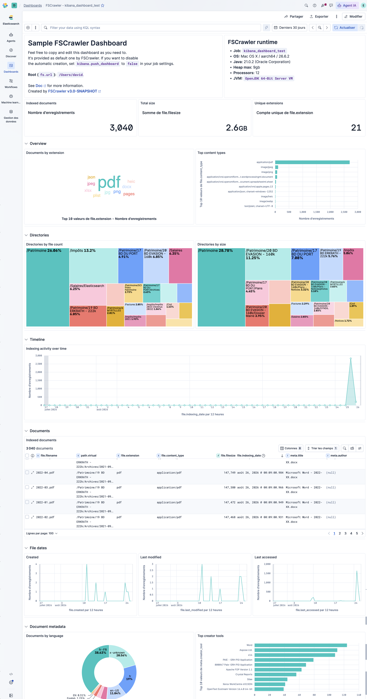

(kibana-settings)=
# Kibana settings

```{contents}
:backlinks: entry
```

```{versionadded} 3.0
```

FSCrawler can create a default Kibana dashboard when a job starts, using the
[Kibana Dashboards API](https://elastic.github.io/dashboards-api-spec/dashboards)
(generally available in Kibana 9.5+).

Here is a list of Kibana settings (under `kibana.` prefix):

| Name                          | Environment Variable                   | Default value             | Documentation                                      |
|-------------------------------|----------------------------------------|---------------------------|----------------------------------------------------|
| `kibana.url`                  | `FSCRAWLER_KIBANA_URL`                 | `http://127.0.0.1:5601`   | [Kibana URL](#kibana-url)                          |
| `kibana.push_dashboard`       | `FSCRAWLER_KIBANA_PUSH_DASHBOARD`      | `true`                    | [Push dashboard](#push-dashboard)                  |
| `kibana.force_push_dashboard` | `FSCRAWLER_KIBANA_FORCE_PUSH_DASHBOARD`| `false`                   | [Push dashboard](#push-dashboard)                  |
| `kibana.space`                | `FSCRAWLER_KIBANA_SPACE`               | `null` (default space)    | [Kibana space](#kibana-space)                      |
| `kibana.api_key`              | `FSCRAWLER_KIBANA_API_KEY`             | `null`                    | [API Key](#kibana-api-key)                         |

## Kibana URL

Point FSCrawler at your Kibana endpoint:

```yaml
name: "test"
kibana:
  url: "http://127.0.0.1:5601"
```

```{note}
With Elastic's [start-local](https://www.elastic.co/docs/deploy-manage/deploy/self-managed/local-development-installation-quickstart)
tooling (and similar local demos), Kibana is exposed over HTTP even when Elasticsearch may use
HTTPS. Use `http://` in that case.

In production, expose Kibana over HTTPS (TLS termination or `server.ssl.enabled`) and set
`kibana.url` to an `https://` endpoint.
```

## Push dashboard

When `kibana.push_dashboard` is `true` (the default), FSCrawler creates on startup:

1. A **data view** on the job documents index (time field `file.indexing_date`)
2. A **dashboard** named `FSCrawler - <job-name>` that includes:

   * an introductory Markdown panel (FSCrawler version link, docs link, and the job
     ``fs.url`` root)
   * a runtime Markdown panel (OS, Java, heap max, processors)
   * metrics for document count, total ``file.filesize``, and unique ``file.extension`` values
   * an **Overview** section (tag cloud of extensions, top content types)
   * a **Directories** section (treemaps on ``path.virtual.tree`` by file count and by size,
     with Discover drill-down)
   * a **Timeline** section (indexing activity over ``file.indexing_date``)
   * a **Documents** Discover session (filename, virtual path, extension, content type,
     filesize, indexing date, title, author)
   * a collapsed **File dates** section (created / last modified / last accessed; ignores the
     dashboard time picker so the view is global)
   * a collapsed **Document metadata** section (language and creator tool — keyword fields only
     for terms aggregations)



By default, if the dashboard already exists, FSCrawler skips creation (same behaviour as
{ref}`mappings` with `push_templates`). To overwrite an existing dashboard — for example after
upgrading FSCrawler with new panels — set `force_push_dashboard` to `true`:

```yaml
kibana:
  force_push_dashboard: true
```

Provisioning is **soft-disabled** (with a warning) when:

* Kibana is older than **9.5** (Dashboards API not generally available)
* `kibana.url` is missing
* No credentials are available (`elasticsearch.api_key`, `kibana.api_key`, or
  deprecated username/password)
* Kibana is unreachable

In those cases the crawler continues normally without a dashboard.

To disable provisioning explicitly:

```yaml
kibana:
  push_dashboard: false
```

## Kibana space

Optional Kibana space id. When unset, the default space is used:

```yaml
kibana:
  url: "http://127.0.0.1:5601"
  space: "marketing"
```

## Kibana API Key

By default FSCrawler reuses `elasticsearch.api_key` (or basic auth) for Kibana.
Set `kibana.api_key` only when Kibana needs a different credential:

```yaml
kibana:
  url: "http://127.0.0.1:5601"
  api_key: "VnVhQ2ZHY0JDZGJrUW0tZTVhT3g6dWkybHAyYXhUTm1zeWFrdzl0dk5udw=="
```

## Example with start-local

```yaml
name: "resumes"
fs:
  url: "/tmp/es"
elasticsearch:
  urls:
    - "http://localhost:9200"
  api_key: "<ES_LOCAL_API_KEY>"
kibana:
  url: "http://localhost:5601"
```

After the first crawl, open Kibana → **Dashboards** → **FSCrawler - resumes**.
