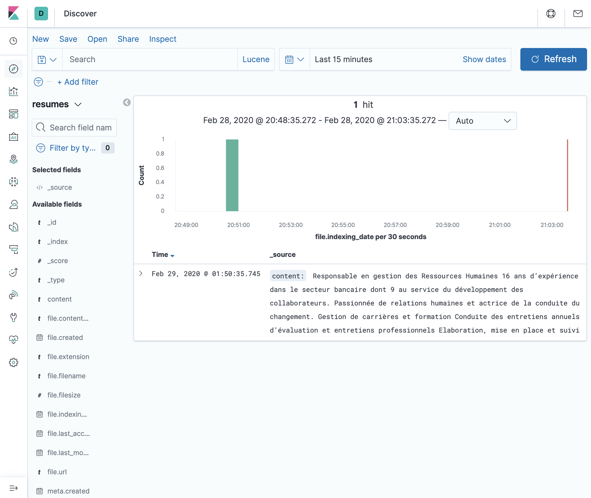
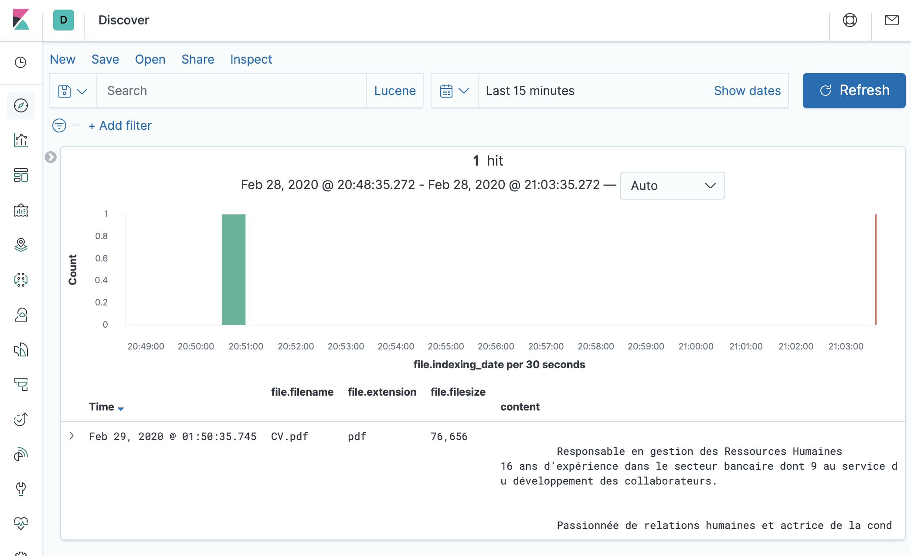
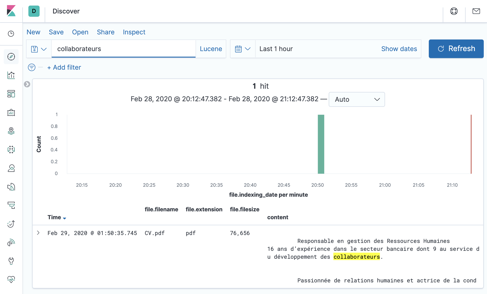
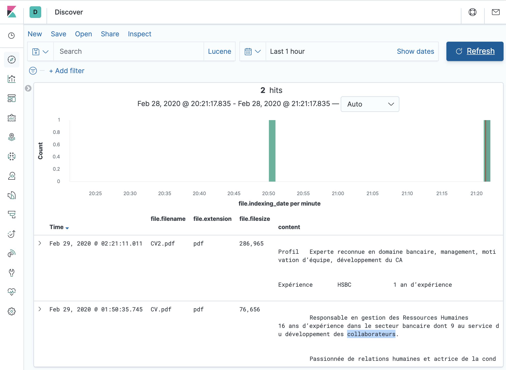

# Tutorial

This tutorial use case is:

Search for the resumes (PDF or Word file which resides in One drive or local) and search for anything in the content
using Kibana. For example location worked or the previous company, etc.

The fastest way to follow this tutorial is to run Elasticsearch and Kibana with Elastic's
[start-local](https://www.elastic.co/docs/deploy-manage/deploy/self-managed/local-development-installation-quickstart)
script, and FSCrawler with Docker. If you prefer a manual install, see
[Alternative: manual installation](#alternative-manual-installation).

```{note}
The default Kibana dashboard requires **Kibana 9.5+** (Dashboards API). See {ref}`kibana-settings`.
```

## Recommended: Docker and start-local

### Prerequisites

* [Docker](https://docs.docker.com/get-docker/) must be installed and running
* On Windows, use [WSL](https://learn.microsoft.com/en-us/windows/wsl/install) as required by `start-local`

### Start Elasticsearch and Kibana

Run Elastic's `start-local` script:

```sh
curl -fsSL https://elastic.co/start-local | sh
```

This creates an `elastic-start-local` directory, starts Elasticsearch and Kibana in Docker, and writes credentials
to `elastic-start-local/.env`.

After a few seconds, check that the services are up:

* Elasticsearch: <http://localhost:9200>
* Kibana: <http://localhost:5601>

Load the generated API key (you will need it for FSCrawler):

```sh
cd elastic-start-local
source .env
echo "$ES_LOCAL_API_KEY"
```

```{note}
`start-local` is meant for local development only. It exposes HTTP (not HTTPS) on `localhost`.
```

### Start FSCrawler with Docker

* Pull the FSCrawler image. See {ref}`docker` for details (including the smaller `noocr` variant):

```sh
docker pull dadoonet/fscrawler
```

* Create a job named `resumes`:

```sh
docker run -it --rm \
  -v ~/.fscrawler:/root/.fscrawler \
  dadoonet/fscrawler --setup resumes
```

* Edit `~/.fscrawler/resumes/_settings.yaml` so the crawler reads documents from `/tmp/es` **inside** the
  container (this is the default `fs.url` value). A minimal job file looks like:

```yaml
---
name: "resumes"
fs:
  url: "/tmp/es"
```

  Leave `elasticsearch.index` unset. FSCrawler will index into `resumes_docs` and create a `resumes` alias.

* Put your resume files in a local folder (for example `~/resumes`), then start FSCrawler.
  From a Docker container, Elasticsearch and Kibana on the host are reached via `host.docker.internal`
  (not `127.0.0.1`):

```sh
# From the elastic-start-local directory, or after: source elastic-start-local/.env
docker run -it --rm \
  --add-host=host.docker.internal:host-gateway \
  -v ~/.fscrawler:/root/.fscrawler \
  -v ~/resumes:/tmp/es:ro \
  -e FSCRAWLER_ELASTICSEARCH_URLS=http://host.docker.internal:9200 \
  -e FSCRAWLER_ELASTICSEARCH_API_KEY="${ES_LOCAL_API_KEY}" \
  -e FSCRAWLER_KIBANA_URL=http://host.docker.internal:5601 \
  dadoonet/fscrawler resumes
```

```{note}
`--add-host=host.docker.internal:host-gateway` is required on Linux so the container can reach services
published on the host. On Docker Desktop (macOS / Windows), `host.docker.internal` is usually available
already; keeping the flag is still fine.
```

You can also put the Elasticsearch and Kibana settings in `_settings.yaml` instead of environment variables:

```yaml
---
name: "resumes"
fs:
  url: "/tmp/es"
elasticsearch:
  urls:
    - "http://host.docker.internal:9200"
  api_key: "YOUR_ES_LOCAL_API_KEY"
kibana:
  url: "http://host.docker.internal:5601"
```

Use `http://` (not `https://`) with `start-local`. Copy the API key value from `ES_LOCAL_API_KEY` in
`elastic-start-local/.env`.

FSCrawler should index all the documents inside your directory. Then continue with
[Open the default dashboard](#open-the-default-dashboard).

````{note}

 If you want to start again reindexing from scratch instead of monitoring the changes, stop FSCrawler, restart it
 with the `--restart` option:

 ```bash
 docker run -it --rm \
   --add-host=host.docker.internal:host-gateway \
   -v ~/.fscrawler:/root/.fscrawler \
   -v ~/resumes:/tmp/es:ro \
   -e FSCRAWLER_ELASTICSEARCH_URLS=http://host.docker.internal:9200 \
   -e FSCRAWLER_ELASTICSEARCH_API_KEY="${ES_LOCAL_API_KEY}" \
   -e FSCRAWLER_KIBANA_URL=http://host.docker.internal:5601 \
   dadoonet/fscrawler resumes --restart
 ```
````

## Alternative: manual installation

Use this path if you prefer to download Elasticsearch, Kibana, and FSCrawler yourself instead of using Docker.

### Prerequisites

* Java {{ java_version }}+ must be installed
* `JAVA_HOME` must be defined

### Install Elastic stack

* Download [Elasticsearch](https://www.elastic.co/downloads/elasticsearch)
* Download [Kibana](https://www.elastic.co/downloads/kibana) **9.5+** (required for the default dashboard)
* Start Elasticsearch server
* Start Kibana server
* Check that Kibana is running by opening <http://localhost:5601>

### Start FSCrawler

* Download FSCrawler. See {ref}`installation`.
* Open a terminal and navigate to the `fscrawler` folder.
* Type:

```sh
# On Linux/Mac
bin/fscrawler --setup resumes
# On Windows
.\bin\fscrawler --setup resumes
```

* It will create a sample configuration file.
* Go to the FSCrawler configuration folder to edit the job configuration. The FSCrawler configuration folder named
  `.fscrawler` is by default in the user home directory, like `C:\Users\myuser` on Windows platform or
  `~` on Linux/macOS. In this folder, you will find another folder named `resumes`. Enter this folder:

```sh
# On Linux/macOS
cd ~/.fscrawler/resumes
# On Windows
cd C:\Users\myuser\.fscrawler\resumes
```

* Edit the `_settings.yaml` file which is in this folder and change the `url` value to your folder
  which contains the resumes you would like to index.

  On Linux/macOS:
  
  ```yaml
  ---
  name: "resumes"
  fs:
    url: "/path/to/resumes"
  ```
  
  On Windows:
  
  ```yaml
  ---
  name: "resumes"
  fs:
    url: "c:\\path\\to\\resumes"
  ```

  `kibana.url` defaults to `http://127.0.0.1:5601`, so you can leave it unset when Kibana runs locally.
  If your Elasticsearch cluster requires an API key (recommended), add it under `elasticsearch` as well.
  See {ref}`elasticsearch-settings`.

* Start again FSCrawler:

```sh
# On Linux/macOS
bin/fscrawler resumes
# On Windows
.\bin\fscrawler resumes
```

FSCrawler should index all the documents inside your directory.

````{note}

 If you want to start again reindexing from scratch instead of monitoring the changes, stop FSCrawler, restart it
 with the `--restart` option:

 ```bash
 # On Linux/Mac
 bin/fscrawler resumes --restart
 # On Windows
 .\bin\fscrawler resumes --restart
 ```
````

## Open the default dashboard

On startup, FSCrawler creates a data view and a dashboard named **FSCrawler - resumes** (when Kibana
is reachable and `kibana.push_dashboard` is enabled — the default). See {ref}`kibana-settings`.

* Open [Kibana](http://localhost:5601)
* Go to **Dashboards** and open **FSCrawler - resumes**

You should see an overview of your indexed files (counts, extensions, directories, timeline, and a
document table). Adjust the time picker if panels look empty — the dashboard uses
`file.indexing_date` by default.

## Search for the CVs

To search resume content (for example a previous company or a location), use Discover on the data
view FSCrawler created:

```{note}
The UI in Kibana changes from time to time. The screenshots below might not be up to date with the
current version of Kibana.
```

* Open [Discover](http://localhost:5601/app/discover#/)
* Select the data view for the `resumes` job (documents live in `resumes_docs` by default)
* Adjust the time picker if needed so you cover when the files were indexed



* Add columns such as `content`, `file.filename`, `file.extension`, `file.url`, or `file.filesize`



* Search for content, for example `collaborateurs`, and inspect the highlighted matches



## Adding new files

Just copy new files in the `resumes` folder. It could take up to 15 minutes for FSCrawler to
detect the change. This is the default value for `update_rate` option. You can also change this
value. See {ref}`local-fs-update_rate`.

````{note}

 On some OS, moving files won't touch the modified date and the "new" files won't be detected.
 It's then better probably to copy the files instead.

 You might have to "touch" the files like:

 ```bash
 touch /path/to/resumes/CV2.pdf
 ```
````

Refresh the dashboard or Discover in Kibana to see the changes.


